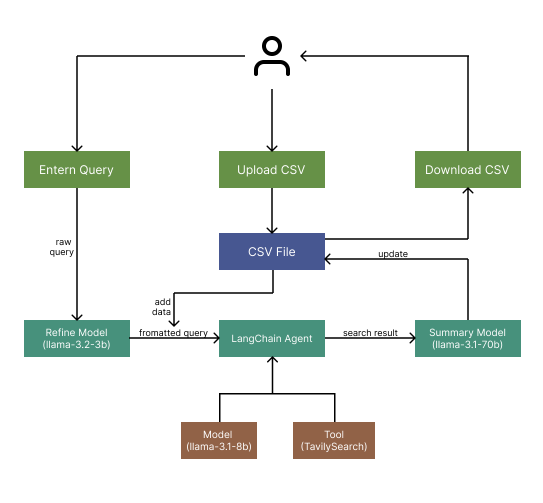

# ML Task
### Project Description
This project simplifies information extraction from datasets by combining machine learning, web scraping, and LLM-based prompt engineering. Users can upload a CSV or connect to Google Sheets, define custom queries using placeholders like {column}, and retrieve specific details (e.g., email addresses, company profiles) via automated web searches. The extracted data is processed, structured, and presented in a user-friendly dashboard, with options to download results.

It follows a 3 LLM approach, for refining query, smartly accessing the web search API and extracting the answer from search results. The architecture of the project is given below.

### Users Guide: 
-  Users can upload their CSV files.
-  Users may also add Google Sheet URL along with sheet name and range.
-  The given Google Sheet must be set to either Read by anyone with link or read access should be given to divijmahajan_co22a4_07@dtu.ac.in
-  User can add query in the query area, and submit to run for each row.
-  The results will be stored in column 'query_result' and accuracy score in 'accuracy_score'.
-  Users can Download the result from the Download button.
  
### Setup Instructions: API Keys and Environment Variables:
- To setup the Environments Variables:
  - Clone this repo and install all module of requirement.txt
  - All the Envrionment variable required are given in secrets_example.txt
  - Create a folder .streamlit and file inside it secrets.toml add all environment variables inside it.
  - Follow the given steps refer [python quickstart tutorial](https://developers.google.com/sheets/api/quickstart/python):
    - Create a new Google console project, enable Spreadsheet API, create a new Oauth credentials for a desktop app and download the json file, save in root folder of this app with name 'credentials.json'.
    - Run the google_get_tokens.py file locally, it will create a token.json file.
    - Copy the token.json file and paste as value of the GOOGLE_TOKEN=""" """
  - Create a new GROQ API, and add as value of the GROQ_API_KEY=""
  - For Langchain and Tavily:
    - Create a new LangChain Smith Tracing project and get all the Langchain API KEYs from [here](https://smith.langchain.com/o/).
    - Get Tavily API keys from [here](https://tavily.com/).
  - Use 'streamlit run dashboard.py' to run it locally.
  - In case the project is needed to be hosted, feel free to host on Streamlit comunity cloud and all the secrets there.
  
### Optional Features: 
- Refining Query to eliminate Typos, expand slang short forms and match according to columns of the uploaded file.
- Using LLM to smartly call the api using Langchain Tools, limiting any bad request.
- Powerful models to sumarize the result and give an accuracy score based on accuracy of the given answer.
- Allows to get data from spreadsheet and choose the sheet name and range, without having to authenticate.
- Allows the inputed query to have slang or even in a different language as whole.

Loom Video Link (Detailed): https://www.loom.com/share/91cb6973dfd248c086f09a95c768d13a?sid=86dfde9f-238e-4444-9d1b-9b7d62c62eab
